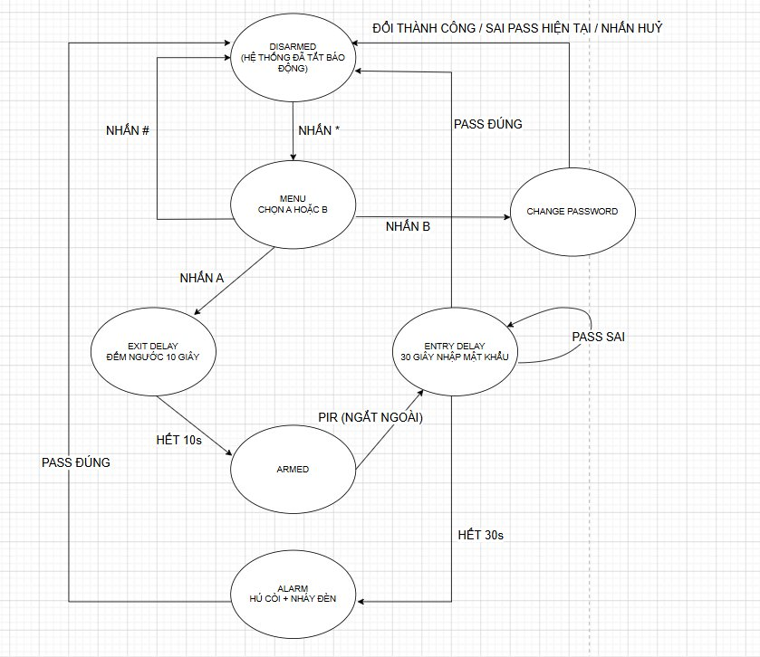

# 🚨 Hệ Thống Báo Động An Ninh — Arduino Security Alarm System

> Đồ án môn CE103.Q21 – Vi xử lý - Vi điều khiển · UIT ĐHQG-HCM

---

## 📖 Tóm Tắt

Hệ thống báo động an ninh được xây dựng trên nền tảng Arduino Uno, sử dụng **cảm biến PIR** để phát hiện xâm nhập thông qua **ngắt ngoài INT0** (ưu tiên cao nhất), kết hợp **ngắt Timer1** để điều khiển còi hú biến tần và đèn LED song song. Toàn bộ logic được tổ chức theo mô hình **Máy Trạng Thái Hữu Hạn (FSM) 6 trạng thái**, đảm bảo hệ thống phản ứng tức thì, phân biệt được người được phép và kẻ xâm nhập thông qua cơ chế **Delay vào 30 giây** xác thực mật khẩu.

---

## ✨ Tính Năng

| # | Tính Năng | Chi Tiết |
|---|-----------|----------|
| 1 | **Ngắt ngoài INT0** | Phát hiện xâm nhập tức thì qua PIR, ưu tiên cao nhất, không bị block bởi `loop()` |
| 2 | **Ngắt Timer1 (20ms)** | Tạo còi hú biến tần 500–1500 Hz và nháy LED song song khi ALARM |
| 3 | **FSM 6 trạng thái** | Luồng điều khiển rõ ràng, chuyển trạng thái chính xác và ổn định |
| 4 | **Exit Delay (10 giây)** | Đếm ngược cho phép người dùng rời khỏi khu vực trước khi PIR hoạt động |
| 5 | **Entry Delay (30 giây)** | Cửa sổ nhập mật khẩu tắt báo động, phân biệt chủ nhà và kẻ xâm nhập |
| 6 | **Đổi mật khẩu** | Quy trình 2 bước có xác thực mật khẩu cũ *(chức năng bổ sung)* |
| 7 | **Giao diện LCD thời gian thực** | Hiển thị đếm ngược, trạng thái hệ thống và ô nhập mật khẩu ẩn `*` |

---

## 🔄 Sơ Đồ Trạng Thái (FSM)



| Trạng Thái | Mô Tả | Điều Kiện Chuyển |
|------------|-------|-----------------|
| `DISARMED` | Hệ thống tắt báo động, chờ người dùng | Nhấn `*` → MENU |
| `MENU` | Chọn chức năng A hoặc B | `A` → EXIT_DELAY · `B` → Đổi pass · `#` → DISARMED |
| `EXIT_DELAY` | Đếm ngược 10s để rời khu vực | Hết 10s → ARMED |
| `ARMED` | Đang canh gác, chờ PIR kích hoạt | PIR HIGH (INT0) → ENTRY_DELAY |
| `ENTRY_DELAY` | Đếm ngược 30s chờ nhập mật khẩu | Pass đúng → DISARMED · Hết 30s → ALARM |
| `ALARM` | Hú còi + nháy đèn cảnh báo | Pass đúng → DISARMED |

> **Lưu ý bảo mật:** Trong trạng thái `ARMED`, `loop()` không xử lý phím nào — không có phím tắt nào có thể vượt qua quá trình xác thực.

---

## 🛠️ Phần Cứng

### Linh Kiện

| Linh Kiện | Số Lượng | Ghi Chú |
|-----------|:--------:|---------|
| Arduino Uno (ATmega328P) | 1 | Vi điều khiển trung tâm |
| Cảm biến PIR HC-SR501 | 1 | Phát hiện chuyển động, góc 120°, tầm 3–7m |
| Bàn phím ma trận 4×4 | 1 | Nhập mật khẩu |
| LCD 16×2 + Module I2C (PCF8574T) | 1 | Hiển thị trạng thái, địa chỉ `0x27` |
| Buzzer | 1 | Còi cảnh báo biến tần |
| LED | 1 | Đèn báo động |
| Điện trở 220Ω | 1 | Cho LED |
| Breadboard & Dây nối | Nhiều | |

**Tổng dòng tiêu thụ ước tính:** ~120 mA — Nguồn USB 5V/500 mA hoặc adapter 5V đáp ứng đủ.

### Sơ Đồ Kết Nối

| Linh Kiện | Chân Arduino | Ghi Chú |
|-----------|:------------:|---------|
| PIR OUT | `Pin 2` | **Bắt buộc** dùng Pin 2 – Ngắt ngoài `INT0` |
| Buzzer (+) | `Pin 12` | Hỗ trợ PWM, dùng `tone()` |
| LED (+) | `Pin 13` | Qua điện trở 220Ω |
| Keypad Hàng R1–R4 | `11, 10, 9, 8` | Từ trên xuống |
| Keypad Cột C1–C4 | `7, 6, 5, 4` | Từ trái sang phải |
| LCD SDA | `A4` | I2C Data |
| LCD SCL | `A5` | I2C Clock |

> **⚠️ Lưu ý:** Địa chỉ I2C mặc định `0x27`. Nếu LCD không hiển thị, chạy **I2C Scanner** để kiểm tra.

---

## 📚 Thư Viện

Cài qua **Arduino Library Manager** (`Sketch > Include Library > Manage Libraries`):

| Thư Viện | Ghi Chú |
|----------|---------|
| `Wire.h` | Built-in – Giao tiếp I2C |
| `LiquidCrystal_I2C` | Điều khiển LCD I2C |
| `Keypad` | Đọc bàn phím ma trận |
| `TimerOne` | Ngắt định thì Timer1 |

---

## 🚀 Hướng Dẫn Sử Dụng

**Mật khẩu mặc định: `1234`**

### Kích hoạt báo động
```
Nhấn '*' → [MENU] → Nhấn 'A' → Đếm ngược 10s → Ra khỏi khu vực → [ARMED]
```

### Tắt báo động khi về nhà
```
Bước vào (PIR phát hiện) → Nhập PIN trong 30s → Nhấn '#' → [DISARMED]
```
> Nếu không nhập kịp trong 30 giây → Còi hú + Đèn nháy → trạng thái `ALARM`

### Tắt còi khi báo động đang kêu
```
Nhập đúng PIN → Nhấn '#' → [DISARMED]
```

### Đổi mật khẩu *(chức năng bổ sung)*
```
Nhấn '*' → [MENU] → Nhấn 'B' → Nhập pass cũ + '#' → Nhập pass mới + '#' → Hoàn tất
```

### Bảng phím tắt
| Phím | Chức năng |
|:----:|-----------|
| `*` | Mở Menu (từ DISARMED) |
| `#` | Xác nhận / Tắt báo động |
| `D` | Xóa ký tự cuối (Backspace) |
| `A` | Kích hoạt báo động (trong Menu) |
| `B` | Đổi mật khẩu (trong Menu) |
| `0–9` | Nhập chữ số mật khẩu |

---

## ⚙️ Chi Tiết Kỹ Thuật

### Ngắt phần cứng

**INT0 (Pin 2) — PIR Interrupt:**
```cpp
void pirInterrupt() {
  if (currentState == ARMED) {
    currentState = ENTRY_DELAY;
    delayStartTime = millis();
    menuDisplayed = false;
  }
}
attachInterrupt(digitalPinToInterrupt(PIR_PIN), pirInterrupt, RISING);
```
Kích hoạt ngay trên cạnh lên (`RISING`) của tín hiệu PIR. Không bị trì hoãn bởi bất kỳ tác vụ nào đang chạy trong `loop()`.

**Timer1 (20ms) — Siren & LED:**
```cpp
void timerIsr() {
  if (currentState == ALARM) {
    sirenFreq += sirenDirection;
    if (sirenFreq > 1500 || sirenFreq < 500)
      sirenDirection = -sirenDirection;
    tone(BUZZER_PIN, sirenFreq);
    ledState = !ledState;
    digitalWrite(LED_PIN, ledState);
  } else {
    noTone(BUZZER_PIN);
    digitalWrite(LED_PIN, LOW);
  }
}
Timer1.initialize(20000); // 20ms
Timer1.attachInterrupt(timerIsr);
```
Tần số còi biến thiên liên tục 500 Hz ↔ 1500 Hz, tăng/giảm 10 Hz mỗi 20ms. LED nháy xen kẽ cùng chu kỳ.

### Thông số thời gian

| Tham số | Giá trị |
|---------|:-------:|
| Exit Delay | **10 giây** |
| Entry Delay | **30 giây** |
| Tần số Timer ngắt | **50 Hz (20ms)** |
| Dải tần còi hú | **500 – 1500 Hz** |
| Bước nhảy tần số | **10 Hz / chu kỳ** |

---

## 📁 Cấu Trúc Dự Án

```
Security_Alarm_System/          ← Thư mục gốc (PlatformIO)
├── src/
│   └── main.cpp                ← Toàn bộ mã nguồn chính
├── include/                    ← Header files (nếu có)
├── lib/                        ← Thư viện cục bộ (nếu có)
├── test/                       ← Unit test
├── platformio.ini              ← Cấu hình PlatformIO
└── README.md                   ← File này
```

### Tổ chức mã nguồn (`main.cpp`)

| Phần | Nội dung |
|------|----------|
| Cấu hình phần cứng | Định nghĩa chân, khởi tạo thư viện |
| `enum SystemState` | 6 trạng thái FSM |
| `pirInterrupt()` | ISR: Ngắt ngoài INT0 |
| `timerIsr()` | ISR: Ngắt Timer1 |
| `loop()` / `switch-case` | Điều phối chuyển trạng thái |
| `handleEntryDelay()` | Xử lý đếm ngược 30s + nhập PIN |
| `handlePasswordInput()` | Logic nhập / xác nhận / xóa PIN |
| `changePasswordRoutine()` | Đổi mật khẩu 2 bước *(bổ sung)* |
| `updateLCD()` | Cập nhật nội dung màn hình LCD |

---

## ⚠️ Hạn Chế & Hướng Phát Triển

### Hạn Chế Hiện Tại

- **RAM only:** Mật khẩu lưu trên RAM, mất nguồn sẽ reset về `1234`.
- **PIR delay:** Cảm biến HC-SR501 có độ trễ phần cứng 1–2 giây.
- **Không giới hạn sai mật khẩu:** Chưa có cơ chế khóa sau nhiều lần nhập sai.
- **Hoạt động độc lập:** Chưa cảnh báo từ xa qua mạng hoặc SMS.
- **Không có nguồn dự phòng:** Mất điện là mất bảo vệ.

### Hướng Phát Triển

- Lưu mật khẩu vào **EEPROM** để giữ nguyên khi mất nguồn.
- Thêm **khóa tài khoản** sau N lần nhập sai liên tiếp.
- Tích hợp **ESP8266/ESP32** để gửi cảnh báo qua WiFi, Telegram, SMS.
- Thêm **nguồn dự phòng pin** đảm bảo hoạt động khi cúp điện.
- Nâng cấp lên **camera + nhận diện khuôn mặt** (ESP32-CAM / Raspberry Pi) để loại bỏ cảnh báo giả.

---

## 📄 Tài Liệu Tham Khảo

- Tài liệu giảng dạy môn CE103 – Vi xử lý, Vi điều khiển. UIT, ĐHQG-HCM.
- [Arduino Security Alarm System Project – HowToMechatronics](https://howtomechatronics.com/projects/arduino-security-alarm-system-project/)
- [TimerOne Library – Arduino Playground](https://playground.arduino.cc/Code/Timer1/)
- [Keypad Library – Arduino Playground](https://playground.arduino.cc/Code/Keypad/)

---

